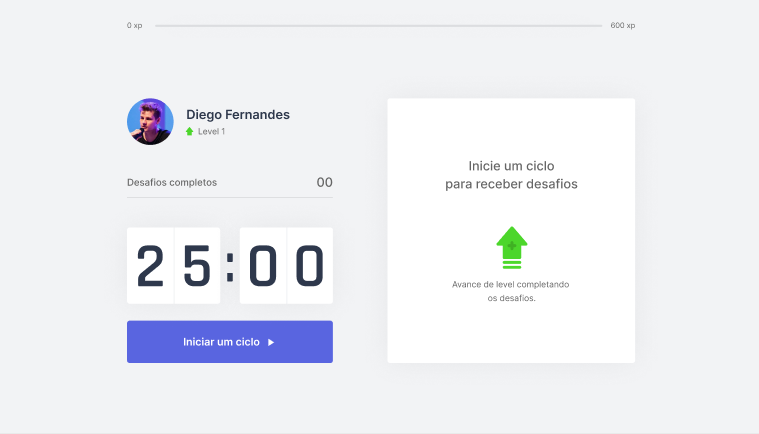
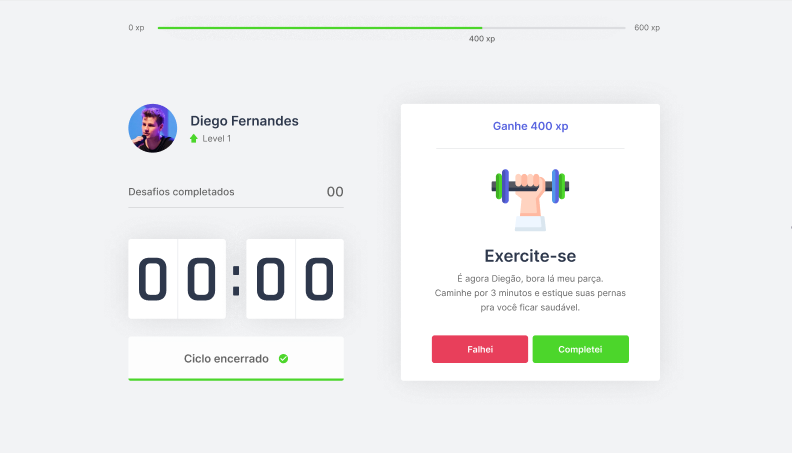
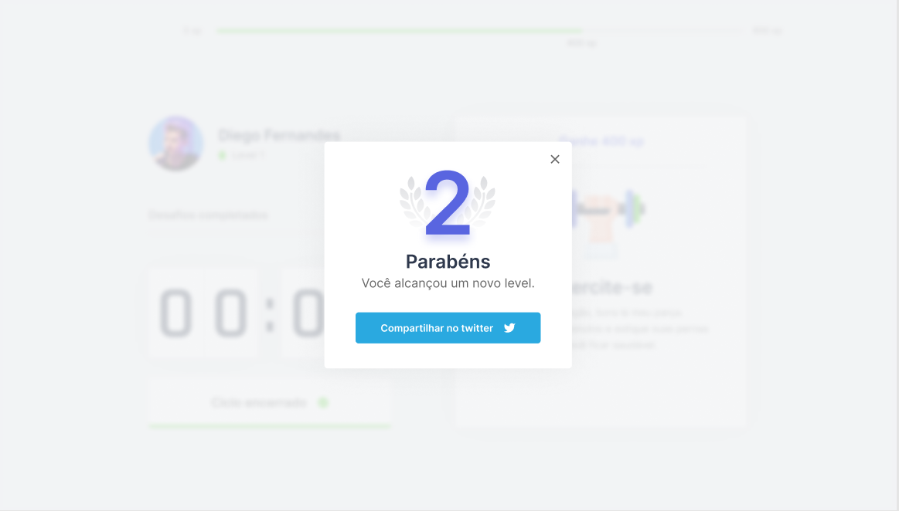
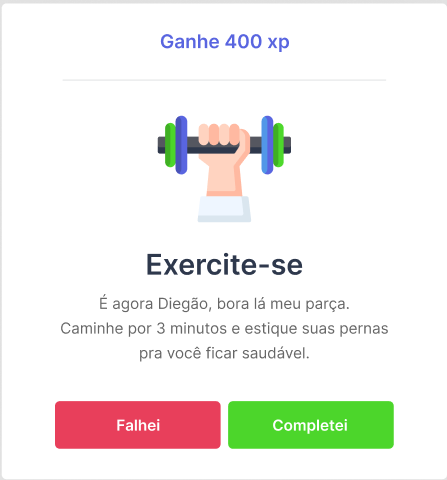
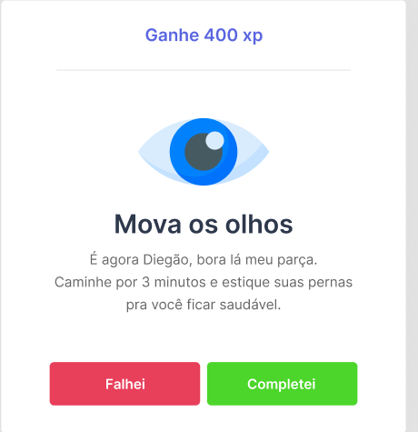

<h1 align="center">
  
</h1>

<p align="center">
  <a href="#-projeto">Projeto</a>&nbsp;&nbsp;&nbsp;|&nbsp;&nbsp;&nbsp;
  <a href="#-tecnologias">Tecnologias</a>&nbsp;&nbsp;&nbsp;|&nbsp;&nbsp;&nbsp;
  <a href="#-layout">Layout</a>&nbsp;&nbsp;&nbsp;|&nbsp;&nbsp;&nbsp;
  <a href="#-como-executar">Como executar</a>&nbsp;&nbsp;&nbsp;|&nbsp;&nbsp;&nbsp;
  <a href="#-como-executar">Demo</a>&nbsp;&nbsp;&nbsp;|&nbsp;&nbsp;&nbsp;
</p>

<br>

<p align="center">
  
</p>


## 💻 Projeto

O Move.it é uma aplicação que usa a técnica de [Pomodoro](https://en.wikipedia.org/wiki/Pomodoro_Technique) para alterna periodos de foco e descanso no uso do computador, e motivando o usuário a fazer exercícios físicos rápidos e de bem-estar nesses intervalos. Segundos [estudos](https://www.conquistesuavida.com.br/noticia/ficar-muito-tempo-online-pode-ser-pessimo-para-a-sua-saude-descubra-por-que_a8972/1), relatam que passar horas continuas em frente ao computador, sem fazer descansos ou atividade física pode ser prejudicial a saúde. Essa aplicação foi desenvolvida durante a 4° edição da Next Level Week da @Rocketseat.


## ✨ Tecnologias

Esse projeto foi desenvolvido com as seguintes tecnologias:

- [React](https://reactjs.org)
- [Next.js](https://nextjs.org/)
- [TypeScript](https://www.typescriptlang.org/)

### Novos Aprendizados

- [useContext Hook](https://reactjs.org/docs/hooks-reference.html#usecontext)
- SSR (Server Side Rendering)
- JS Cookie ([js-cookie]()https://github.com/js-cookie/js-cookie)
- Deploy na [Vercel](vercel.com/)


## 🔖 Layout

Você pode visualizar o layout da versão 1 desse projeto através [desse link](https://www.figma.com/file/ge20pu3ofMOKoliUyKx1Nl/Move.it-1.0). 

<div>
  </br>
  </br>
  </br>

  <div>
    
    
  </div>
  </br>

</div>

## 🚀 Como executar

- Clone o repositório
```zsh
git clone https://github.com/rafaelvieirab/moveit-nlw4.git
cd moveit-nlw4/moveit
```

- Instale as dependências com `yarn` ou `npm`:
```zsh
yarn install
```
, ou
```zsh
npm install
```

- Inicie o servidor com `yarn dev` ou `npx dev`
- Acesse [`localhost:3000`](http://localhost:3000) para abrir a aplicação.

## Live Demo

- Acesse [moveit](https://moveit-pous4ste0-rafaelvieirab.vercel.app/) para usa-la online.